# README

# Rebuilt 

## Identification of the problem to solve by building this particular marketplace app.
ReBuilt is a marketplace that seeks to help those affected by extreme weather events by offering them a platform to buy and sell recycled, new and unused building materials in an effort to help them get back on their feet, albeit with limited financial resources. 

## Why is it a problem that needs solving?
Extreme weather events continue to increase in frequency. The severe floods in 2022 destroyed countless homes in Northern NSW and Southern Queensland. The flooding not only affected homes, but incomes as well as many businesses were left decimated or no longer operable with the extreme weather destroying shopfronts and offices. 

The crisis has been made worse further, with a shortage of new building materials stemming from supply chain disruptions and labor shortages in the building industry from the Covid 19 pandemic. Moreover, population growth in recent years has led to a significant amount of new houses being constructed, further contributing to the supply shortage. However, increased building activity has also resulted in an increase in leftover/unused building materials, which until ReBuilt, often ended up in landfill. 

## Link to Heroku Deployed App
https://rebuilt-official.herokuapp.com/

## Link To Github
https://github.com/felixmckenzie/rebuilt

## Description of your marketplace app (website)

### Purpose 
A marketplace for recycled, secondhand and unused building materials specifically for people rebuilding their homes after natural disasters/extreme weather events. 

### Functionality / Features 

#### User Sign up / Sign In Authentication 
Rebuilt leverages the Devise gem for authentication. Users are able to sign up to the app with a username, password and email. User credentials are strongly encrypted, and when their session ends they will be prompted to sign in again to prove who they are. Guest users (Those who have not signed up) are able to view the homepage that presents all available listings, however to visit a specific listing for more detail and functions, users are required to be signed in. Devise allows the application to correctly ensure a user is signed in before attempting to perform an action, while also allowing the application to easily identify who that user is in the session. This is achieved through the Devise filter and helper methods i.e. authenticate_user!, user_signed_in? and current_user. 

#### Authorisation for Actions 
Rebuilt only exposes users to actions that they are authorised to perform. For example, if you are the seller (person who the listing belongs to) Your user interface for your listing will display buttons to edit or delete the listing, as well as a path to all the conversations with other users. Conversely, if you are a buyer (person who is signed in and not the seller of a post) a listing will display buttons to buy the listing and also a button to add the listing to your personal watchlist. A buyer will also have a button that allows them to message the seller. Authorisation functionality is achieved through the CanCanCan gem, which provides helper methods to identify who can manage the listing and who can buy it. 

#### Save Listings to a Watchlist 
Users have the ability to save a post to a personal watchlist so they can easily retrieve it at a later date. The watchlist function also allows users to see how many other users are watching a listing, which may encourage them to buy it. Users can easily remove a listing from their watchlist, or buy the item for sale.  

#### In App Messaging 
Users are able to message each within the application which allows further inquiry on a listing to be conducted quickly and easily. 

#### Filter and Search Listings 
A search bar on the home page provides users with the ability to search for a specific title of a listing and also to filter the search by category. 
 
#### Checkout and Pay Online with Stripe 
Stripe integration provides a safe and secure way to checkout and pay online with a credit card, this avoids the need for Rebuilt to capture any user card credentials. Upon purchase the user will be directed to a success page where they will be provided with the seller's address to pick up their purchase. 

### Sitemap 
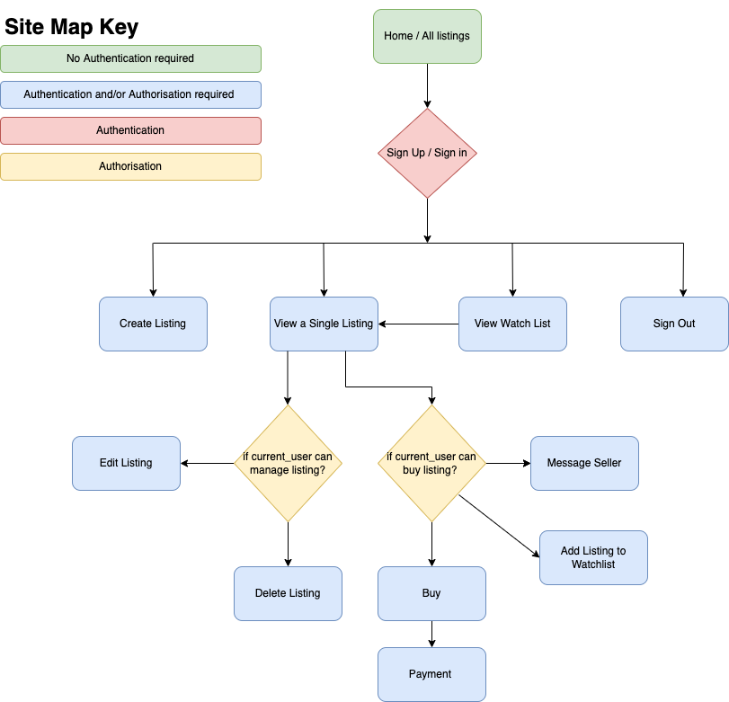

## Tech Stack 

#### Core Technologies Used in Development
- HTML
- Ruby 2.7
- Ruby On Rails 6.1.6
- PostgresQL
- Git 
- Github

#### Gems Added To Project 
- Devise: User authentication
- Bootstrap: Styling
- Jquery: Boostrap dependency
- Simple Form: Form helper 
- Stripe: Payment gateway
- Can Can Can: User authorization
- Kramdown: Markdown to HTML converter
- Ransack: Search bar helper
- Enum Help: Form enum helper
- AWS-S3: Amazon S3 for static file storage in the cloud

#### Deployment
- Heroku 

#### Third Party Services 
- Amazon Web Services 
- Stripe 

#### Target Audience
Th target audience of this application are those building or renovating a home with a focus on those who have been affected by extreme weather events. Rebuilt is also targeted at those working in the building industry and those who have recently built a home to encourage them to on sell their unwanted building materials 

## Screenshots 

## User Stories 
As Jim, a potential buyer. I want to be able to browse listings without signing up and filter the listings by keywords to see if the application has the type of materials I need.

As Susan, I’ve browsed the application and decided I want to make a purchase. I want to easily sign up to the application and keep my user credentials secure. 

As Tim, a plasterer, I often have leftover gyprock sheets after a build. I want an online application where I can post a listing and let potential buyers know how much I have, the price and the condition. 

As Mary, a recent renovator, I have lots of leftover tiles from my renovation. I want to upload photos to the application, so potential buyers can see if the tiles would suit their home. 

As John, a new home owner, we have lots of excess paint from building our house. I want to list the items, but also, edit the price if it doesn’t sell quickly enough. 

As Emma, a homeowner whose kitchen was recently destroyed by flooding, I need kitchen cabinets of a particular size to fit the space. Before I commit to purchasing cabinets from the application I’d like to be able to message the seller in the application to see if the dimensions are correct. 

As Tom, a recent seller, I want to delete all the items from the application that I have sold so others don't inquire. 

As Russel, a buyer. I want to be able to save listings to a watchlist to compare potential purchases and easily retrieve them before I commit to buying. 

As Jane, a buyer. I want the option to pay online using a credit card in a safe and secure way. 

## Wireframes 

### Homepage
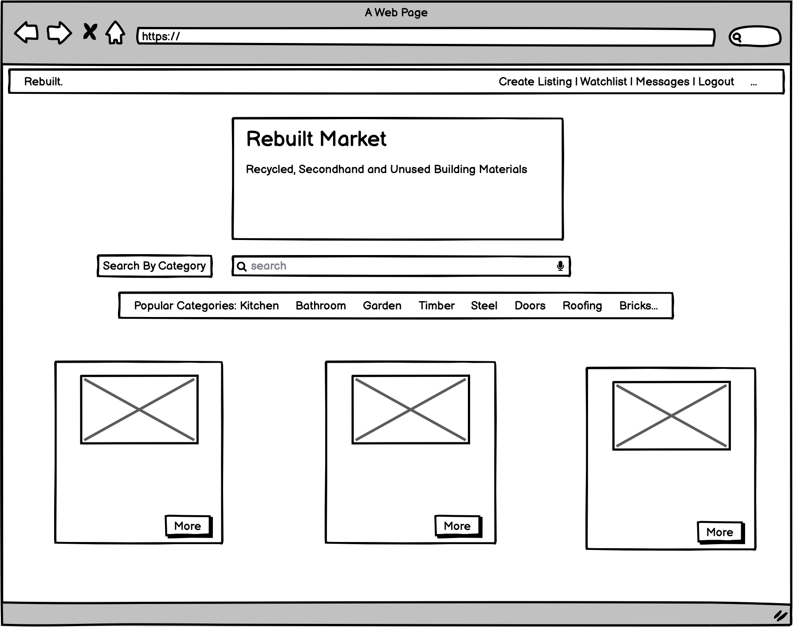
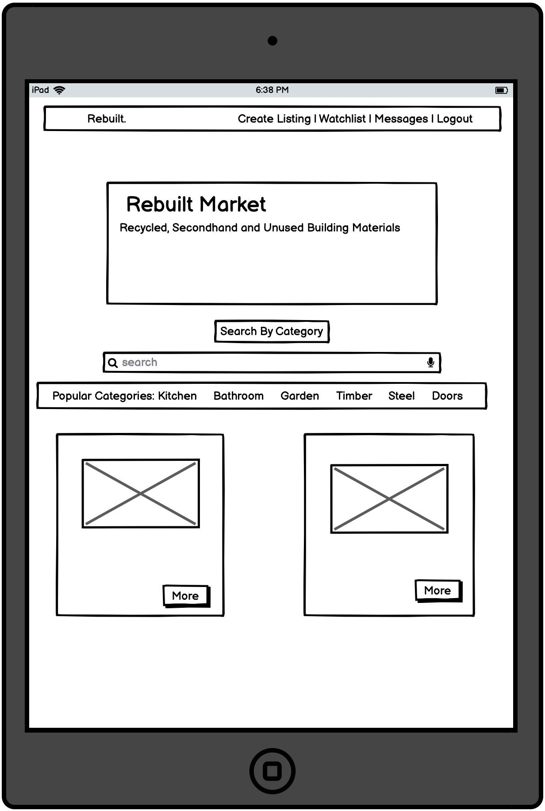
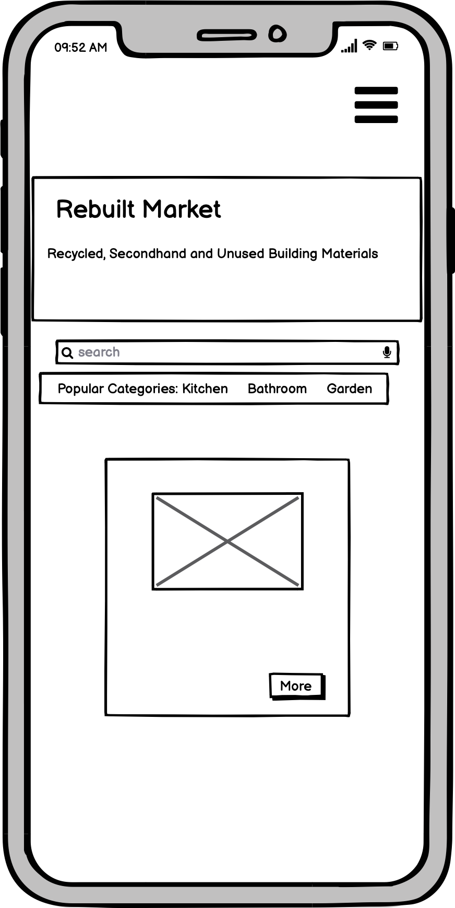
### Show Listing Page
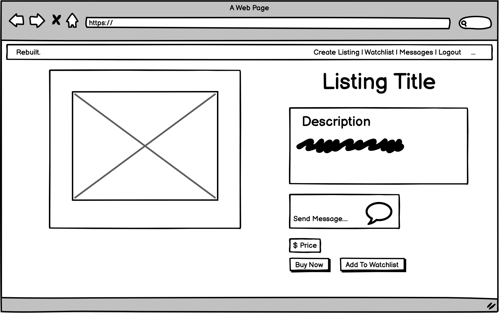
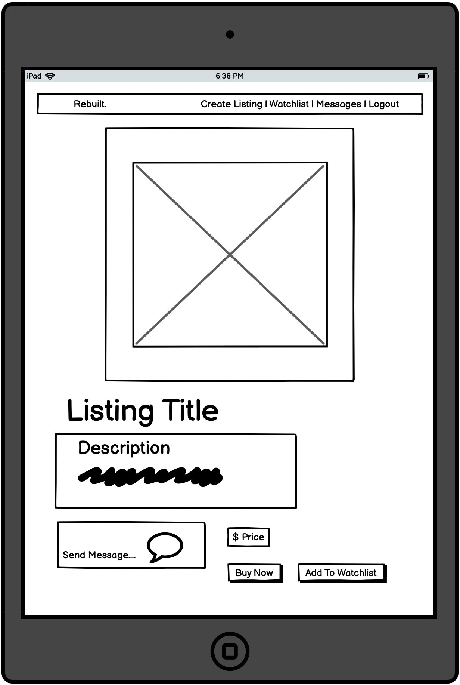
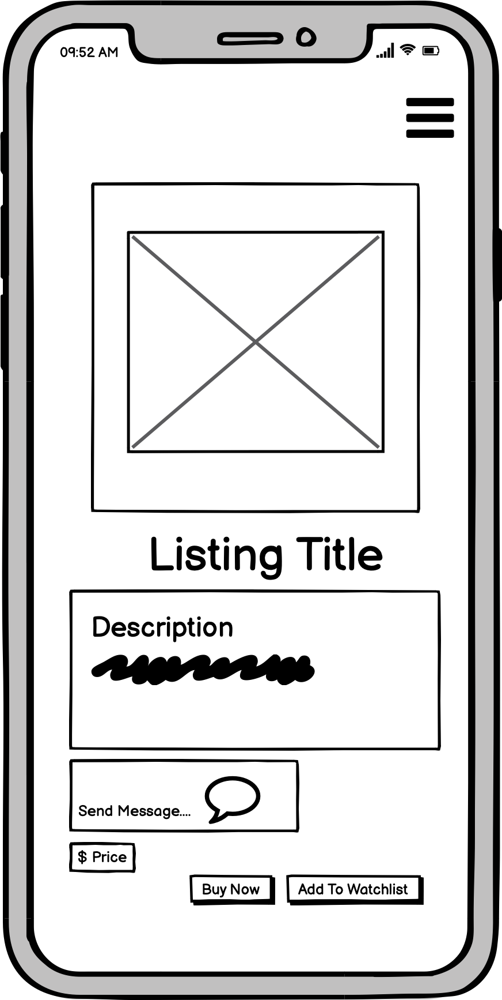
### Sign Up Form
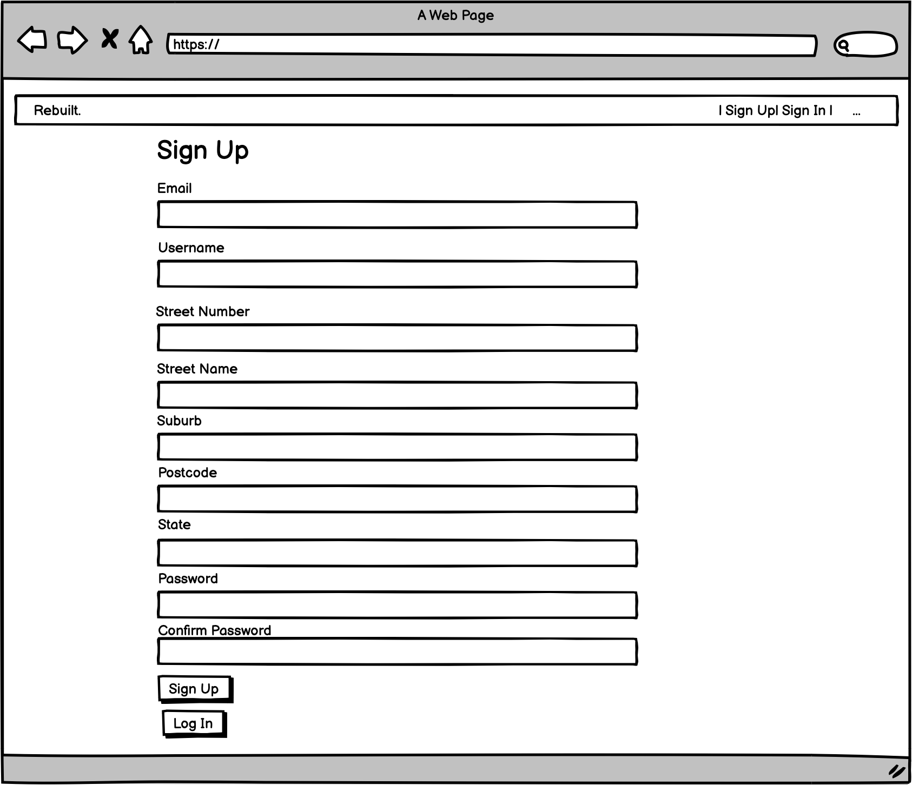
### User Watchlist
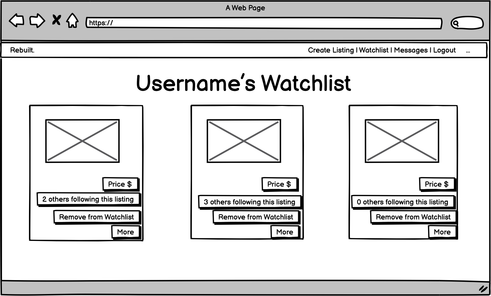
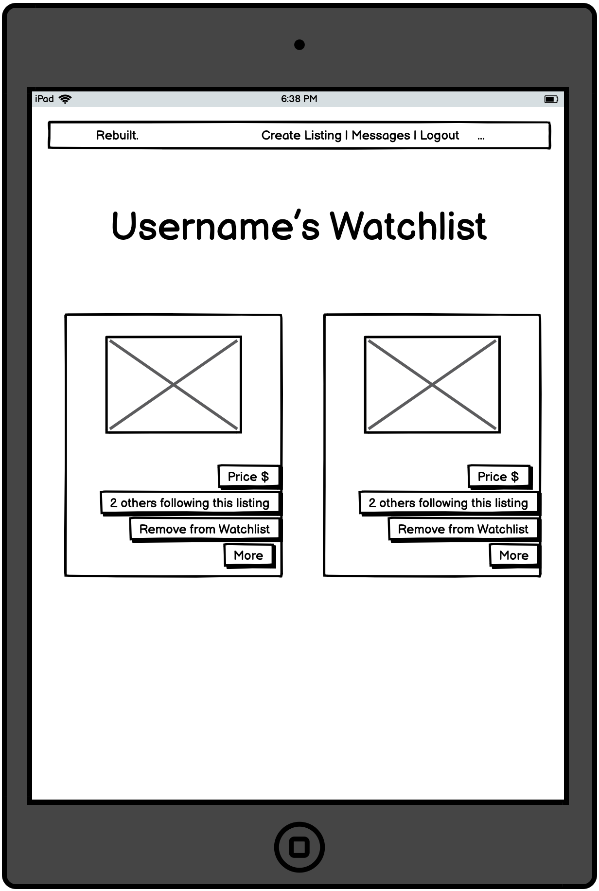
### Messages Page
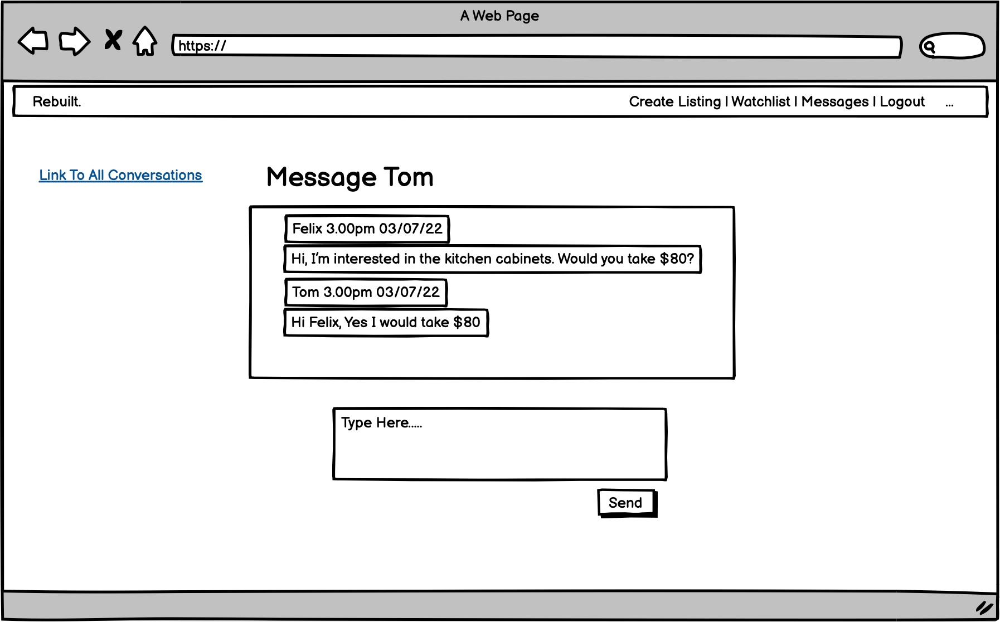

## ERD Diagram
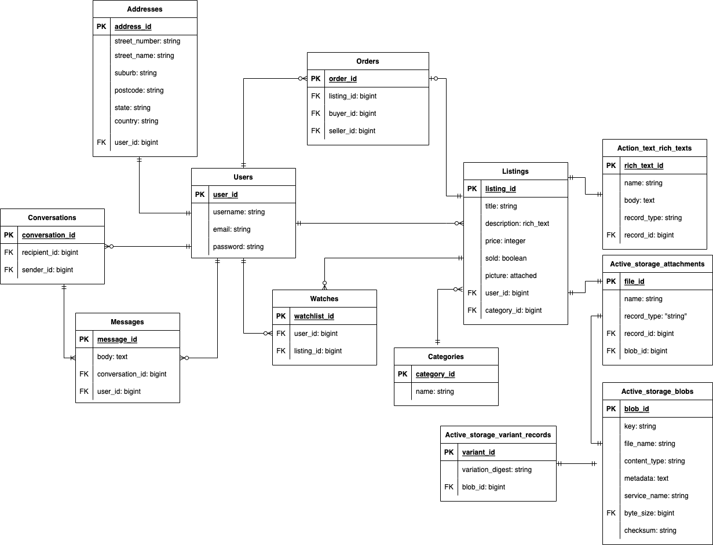

## Explain The Different High-Level Components (Abstractions) In The App
The high level components in Rebuilt inherit from and follow the conventions of both Active Record and Application Controller. 

### Active Record 
Active record provides the representation of data in the application as models, and is the "M" in MVC Architecture. Each instance of an object, such as a User, Listing, Address, Category, Order, Watch Listing, Conversation, or Message maps to a row in a Postgresql database. By mapping each of these rows to an object in the application, Active Record gives us access to all the domain logic needed to allow data to persist and update it as necessary. The domain logic that makes reading and writing to the database possible is all handled through the Active Record ORM pattern, which are abstractions of SQL queries. For instance:

When a User signs up to Rebuilt, they fill in a form, on clicking submit, the user details (fields) are passed through HTTP parameters to newly initialised User and Address models. Models are mapped to the database by New, Create, and Save methods. Furthermore, if a User wanted to update or delete their account, update and destroy methods would trigger the corresponding record to be updated or deleted. Therefore Active Record gives us full CRUD capabilties on the tables created in the database. 

Apart from CRUD operations Active Record gives us the ability to retrieve singular or collections of records that meet a critera through the Active Record query interface. The models that are returned from these queries, can then be manipulated with business logic to be rendered in view. In the application we see these abstractions in various components such as:

A user, need only have access to the conversations that they are involved in. This is achieved through two "Where" statements joined by a conditional "or" i.e. where the current user is the recipient, or, the current user is the sender of a message (see code in conversations controller). This statement retrieves an association collection of all conversation threads the user is involves in, they can then communicate with another user to find further details about listing. 

Another component that takes advantage of Active Record is the search bar. When a user navigates to the Index (home) page they have the ability to search for listings by a keyword contained in the title and by category. Listings belongs to a category, that is to say, listing has a category foreign key field in the database which creates an association between the two records. If a user searches in a category such as "doors" and then uses the keyword "blue", a query is triggered on the Listings table to find all blue doors in the database. By using the includes statement, we are able to use the power of Active Record to find the category attribute without using an additional query, underneath this mapping layer an SQL query is fired to preload all the blue doors (if any). This ultimately results in a faster loaded screen for the end user. 

While the Home Index and Messages page retrieve a set of records, it is also necessary to retrieve a single record. The Watchlist component of Rebuilt is represented by a join table in the database i.e. a User has many Watched_listings and a Listing has many Watchers through the Watches table. When A user wants to remove a Listing they are watching from their personal watch list, we leverage a destroy_by query on the Watches table, here destroy_by finds the listing id passed through the parameters and destroys the assocation on the Watches table. Another simple example of a single query abstraction is when a User decides to navigate to the show page of listing to display more actions they can take i.e read the description, purchase, manage (if authorised) or message the seller. This is achieved  through a simple find query where the id of the listings is passed through the params to find the corresponding record in the database. 

### Application Controller
All controllers in Rebuilt inherit from Application controller. Application Controller allows the application to handle any requests made by our end users by leveraging RESTful resource actions. Application Controller determines which controller needs to handle the user request in order to retrieve or write the appropriate data to and from the correct models. Application is the C in MVC architecture. Requests from our users come via two types of parameters, query string parameters for get requests or post data parameters via a HTML form, to read and write to the database respectively. For instance:

If a user wants to create a listing to sell on Rebuilt, they fill in a form via the create listing link in the navbar. After filling in all the required fields i.e a title, description, price, condition and an associated category, upon hitting submit, the controller handles the posted parameters via a route that matches the controller action. the name of the route lets the controller know to direct that request to the create action in the Listings Controller. The action has a corresponding method of the same name i.e. create action has a correponding create method to be called. 

The Application controller class gives us a number of methods to handle the params hash passed to us by the user in the case of Rebuilt we use a params hash named listing_params. Application Controller provides us with a "Strong Parameters" interface that gives us methods such as "require" and "permit". These methods essentially guard our database against bad users (intentional or unintentional) by requiring the name of the hash to be submitted and permitting the specific indivual attributes and any associated data i.e our listing category. By using the params hash we sanitize our data before entry to the database. From here our user can be redirected to their newly created listing, this lets them know their action succeeded and they can now sell or manage their listing. 

Application Controller also gives use the ability to manage the user's session, Rebuilt uses the Devise gem which gives us a number of methods to use in the controller. We use the current_user to identify the user currently in the session, and authenticate that user via the controllers, to allow them to keep using the application without re-authenticating themselves. Thus by the controller keeping track of the session, the user can freely navigate and use Rebuilt as they wish, which may involve perusing each listing show page, purchasing, managing or a listing, as well as communicating with other users.

## Describe Your Projects Models In Terms Of The Relationships They Have With Each Other 

### User Model
The User Model in Rebuilt has the following relationships
 - A User has many Listings. Allowing them to create, destroy and manage as many listngs as they would like in the database. 
 - A User has one Address. A User can only have one address in reference a pick up location, however they can edit that address as necessary. 
 - A User has many sold orders, that is to say once a buyer (another user) chooses to purchase a listing from a seller, an order is created with the sellers id as a foreign key for reference. Any one user can have many sold orders depending on the number of listings they have sold via an order. 
- A User has many bought orders, inversely any user can choose to purchase as many listings as they would like, and thus a buyers id is created for them on the Orders table. 
- A User has many Watched_Listings through Watches, this describes the relationship where a User has decided to save a Listing to their watch list. They can save zero or many Listings to their Watchlist at any time and we can access these Listings via user.watched_listings . 

### Listing Model 
- A Listing belongs to User, i.e if a User creates a Listing that Listing then has reference to the User that created it. This is necessary for payments, management, and user communication on a specific Listing. 
- A Listing belongs to a Category, This reference to a category allows a user to find all listings that belong to a category e.g kitchen, bathroom etc. 
- A Listing has Rich Text Area. This relationship with an Action text, allows a user to use a trix editor when creating their listings. They can then adjust their font and styling on a listing description as they see fit.
- A Listing has one attached picture, This relationship with active storage allows a user to upload a photo of their listings which is stored as a blob. 
- A Listing has one Order, Since each Listing on Rebuilt is unique i.e. is not part of an inventory of multiple same items, a User may only purchase a Single listing in an Order and once a Listing is part of an Order, it cannot have another Order with another User. thus a Listing can only have one and only one Order. 
- A Listing has many Watchers through Watches, this relationship describes how many Users have saved a Listing to their Watchlist and thus are a "Watcher" of that post. This allows us to use logic such as Listings.watchers to see all the users watching a Listing. 

### Address Model 
- An Address belongs to User, each Address belongs to a User. 

### Category Model 
- Category has many Listings, each category in Rebuilt can have many Listings belonging it.
### Conversation Model
- A Conversation belongs to a Sender, A Conversation has a foreign key of "sender_id" which references a specific user from the Users table i.e the user who sent the message in a Conversation thread. 
- A Conversation belongs to a Recipient, A Conversation has a foreign key of "recipient_id" which references the user who receives a message in a Conversation thread. 
- A Conversation has many messages, messages are what the sender and recipient, send and recieve. and for a Conversation to exist there may be one or many messages sent and/or received via the Users engaged in a conversation. 

### Message Model 
- A Message belongs to a Conversation, a message can only be apart of one conversation thus it belongs to that conversation and has reference to it via a foreign key. 
- A Message belongs to a User, a message also belongs to a user who is the sender in the conversation

### Order Model 
- An Order belongs to a Buyer, i.e. the User who is purchasing the Listing referenced by a buyer_id on the Users table
- An Order belongs to a Seller, i.e. the User who is selling the Listing referenced by a seller_id on the Users table
- An Order belongs to a Listing, i.e. the Listing that is being sold referenced by the Listing id on the Listings table

### Watch Model 
- A watch belongs to a Watched Listing, here the Watched Listing references a listing id on the Listings table
- A watch belongs to a Watcher, here the Watcher is the User that has saved the Listing to their Watchlist. 

## Discuss The Database Relations To Be Implemented In Your Application
In reference to the ERD the relations and their attributes implemented within the Rebuilt Postgresql Database are: 

### Users 
The Users relation stores essential information pertaining to each user of Rebuilt, in order for them to identify themselves in the application and pass on any integral information for payments, communication and management of their listings. The data attributes stored are:
- Email as a string type type
- Password as an encrypted string type
- Username as a string type 

### Addresses
The Addresses relation stores information regarding a pickup (or drop off) address for each user. This allows the sale of listings between users to finish with a location for the exchange of materials. The data attributes stored are: 
- street_number as a string type
- street_name as a string type
- suburb as a string type
- postcode as a string type 
- state as a string type
- country as a string type
- foreign key of user_id

### Listings
The Listings relation stores crucial information regarding the Listing, in order for potential buyers to understand What is they are buying, if it is currently available for sale, a detailed description of the listing, it's condition, the price, and an associated category for easy retrieval and grouping. The data attributes are:
- title as a string type
- description as a rich text type
- condition as an integer type
- price as an integer type 
- sold as a boolean type 
- foreign key of user_id

### Categories
The purpose of the Categories relation is to  simply store a name of a category to associate a Listings record to. The attribute is:
- name as a string type 

### Orders
The Orders relation creates order records attributes of a buyer id, seller id and listing id, and thus is a relationship table made up of foreign keys. The attribute are:
- a listing_id which references the Listings relation
- a buyer_id which references the Users relation
- a seller_id which references the Users relation

### Conversations 
The Conversations relation serves as a relationship table between the communications of a sender and a recipient of messages, and thus is made of user foreign keys. The attributes in the database are:
- sender_id
- recipient_id 

### Messages 
The Messages relation stores the data that is sent in a conversation, it therefore needs to reference the conversation it relates to as well as the user who sent the message, as well as the content of the message. The attributes are:
- body as a text type
- conversation_id as a foreign key
- user_id as a foreign key 

### Watches 
The Watches relation is a relationship table that enables Users to save listings their and also relates a listing being watched to a user. The attributes are 
- listing_id as a foreign key reference
- user_id as a foreign key reference 

### Action Text Rich Text Areas 
The Action Text Rich Text Areas relation is assosciated with the Listings relation, and stores the Listing description as a rich text field. The attributes are 
- name as a string type 
- body as a text type
- record type as a string
- a record_id as a foreign key reference

### Active Storage Attachments 
The Active Storage Attachments relation enables the photo files uploaded to a Listing to persist in the database, this ensure that each time a user visits Rebuilt a picture related to the listing is rendered to the screen each time. The data attributes are:
- name as a string type
- a record type as a string type (i.e the type of file uploaded)
- record_id as a foreign key reference 
- a blob_id as a foreign key reference

## Database Schema Design
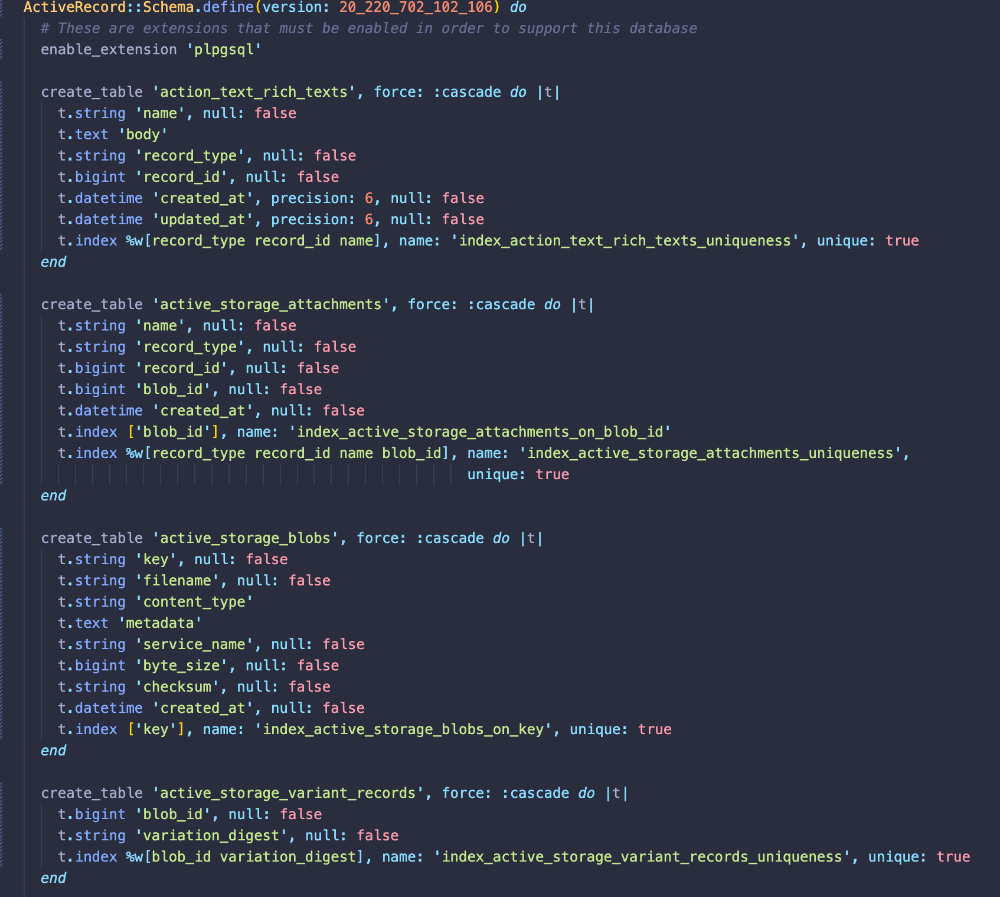
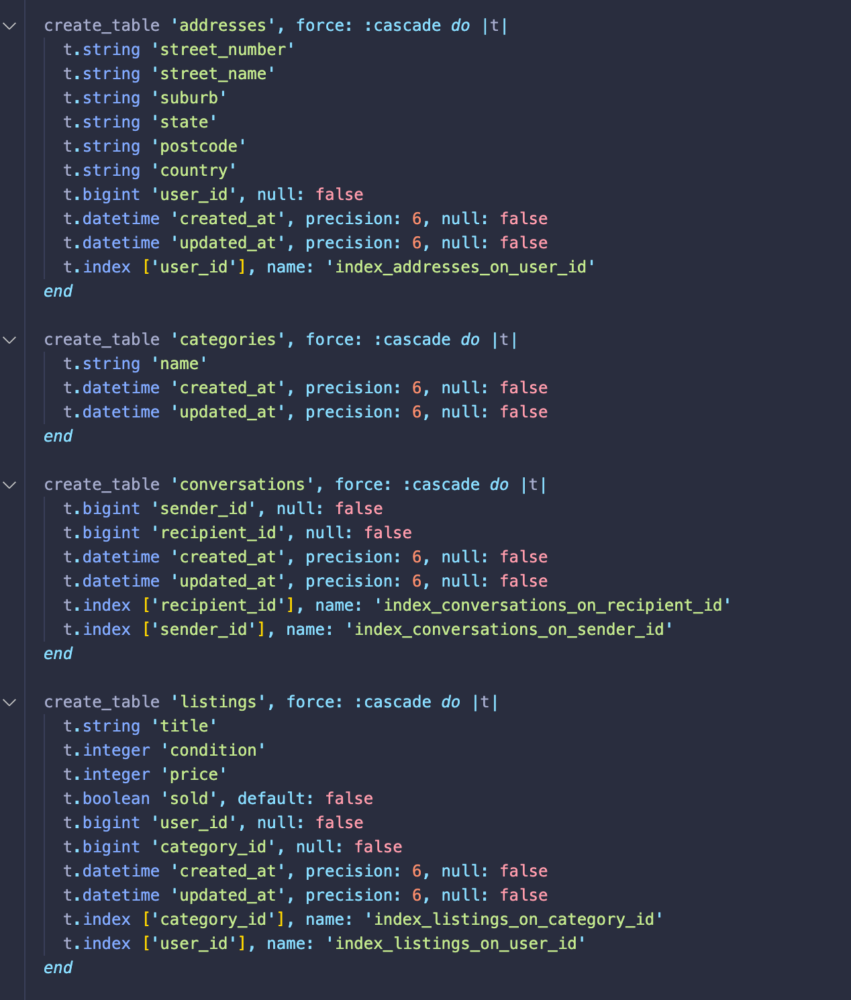
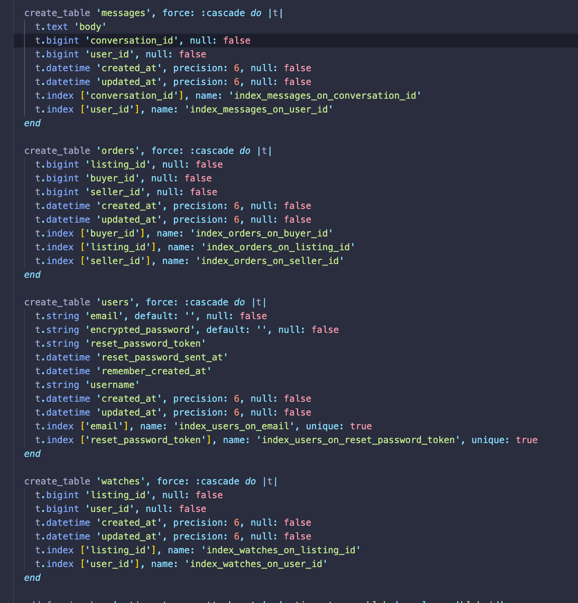
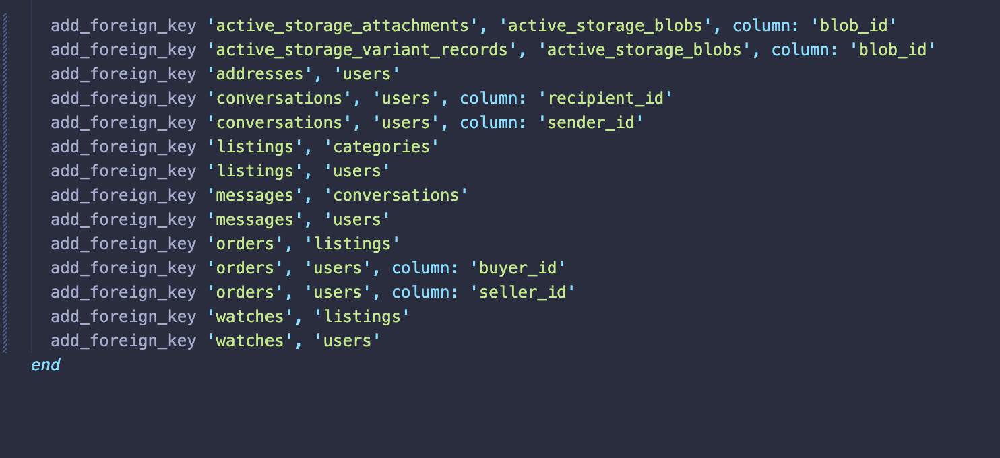

## Describe The Way Tasks are Allocated and Tracked 
A Trello board was used during development to track tasks. The initial board set up involved allocating checklists to cards to create an MVP, once these tasks were checked off, cards were added retroactively for additional features. The link to the board can be found here: 
https://trello.com/b/UzPDKAKk/marketplace-app

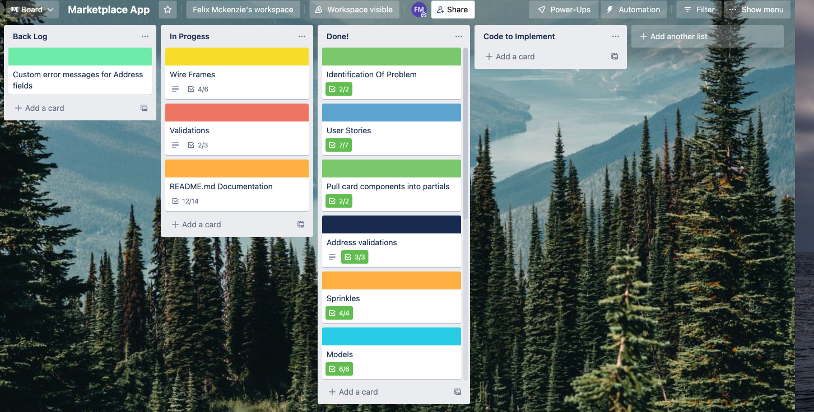
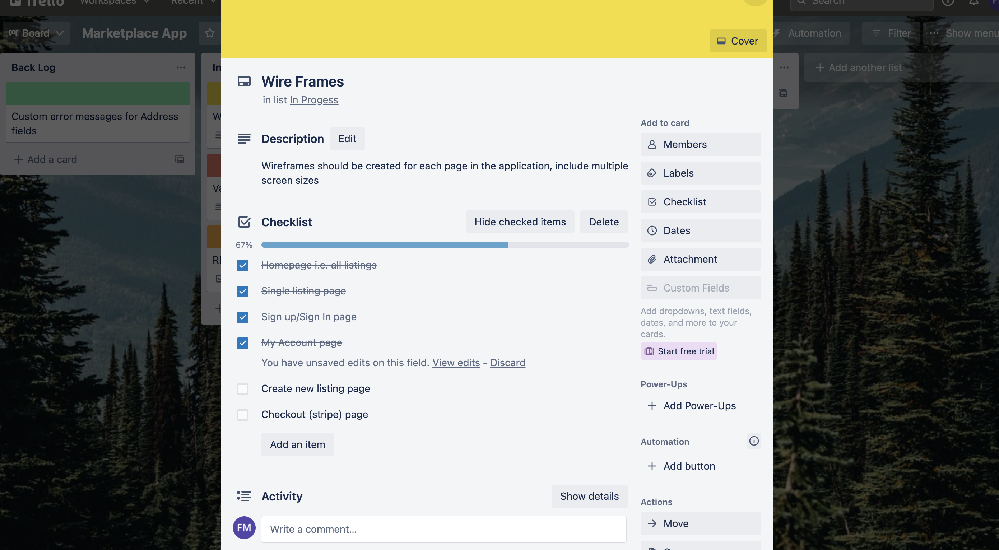

